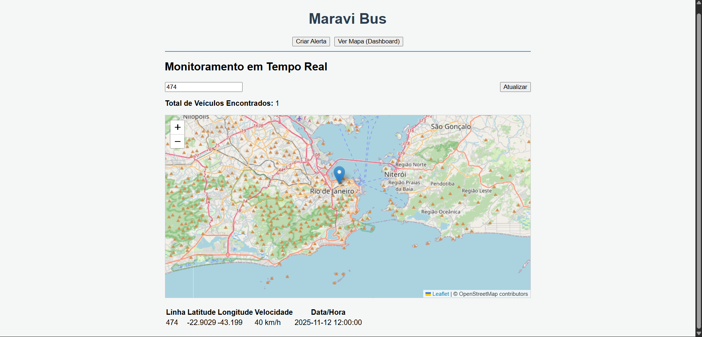
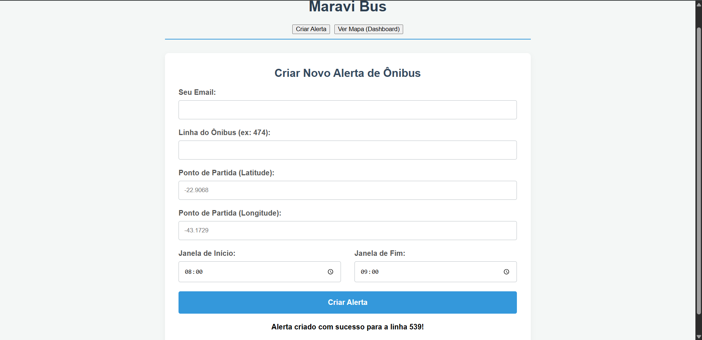
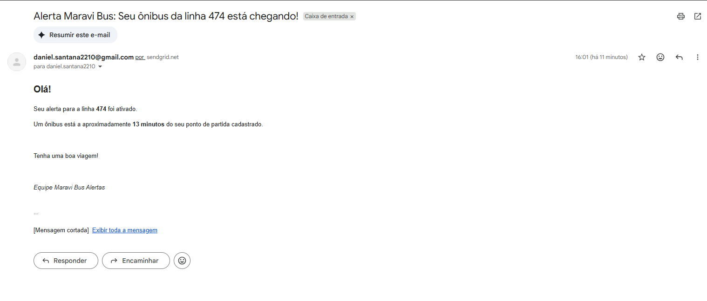

Desafio Maravi - Alerta de Ônibus

Este projeto é uma solução completa para o desafio técnico da Maravi. Trata-se de uma aplicação full-stack dockerizada que monitora a posição dos ônibus do Rio de Janeiro em tempo real, permitindo que usuários criem alertas personalizados e visualizem a frota em um mapa interativo.

O sistema calcula o tempo de chegada (ETA) considerando o trânsito real e notifica o usuário via e-mail quando o ônibus está próximo.

Funcionalidades

Backend (FastAPI & Celery)

Monitoramento em Tempo Real: Coleta dados de GPS da API da Prefeitura do Rio (dados.mobilidade.rio) a cada minuto.

Sistema de Alertas: Processamento assíncrono que verifica alertas ativos, busca dados no cache (Redis) e calcula o tempo de chegada real.

Cálculo de ETA: Integração com a API TravelTime para obter o tempo de deslocamento preciso (driving/transit).

Notificações: Envio automático de e-mails via SendGrid quando um veículo está a menos de 10 minutos do local.

Resiliência (Sistema de Mock): Implementação de um sistema de fallback. Caso a API da Prefeitura esteja instável ou sem dados (comum), o sistema utiliza dados simulados para garantir que a banca avaliadora consiga testar o fluxo de alerta e mapa sem impedimentos.

Frontend (React)

Cadastro de Alertas: Formulário intuitivo para definir linha, local e janela de horário.

Dashboard de Monitoramento:

Mapa Interativo (Leaflet): Visualização dos ônibus em movimento no mapa.

Tabela em Tempo Real: Lista com velocidade, coordenadas e status de cada veículo da linha pesquisada.

Arquitetura e Stack

O projeto foi desenhado utilizando uma arquitetura de microsserviços orquestrados via Docker Compose:

Backend API: FastAPI, SQLModel, Pydantic.

Frontend: React.js, Axios, Leaflet, React-Leaflet.

Worker & Beat: Celery para tarefas agendadas e processamento em segundo plano.

Banco de Dados: PostgreSQL.

Broker & Cache: Redis.

APIs Externas: SendGrid (E-mail), TravelTime (ETA), Dados.Rio (GPS).

Instalação e Execução

Pré-requisitos

Docker Desktop instalado e rodando.

Chaves de API para SendGrid e TravelTime.

1. Configuração de Variáveis de Ambiente

Crie dois arquivos na raiz do projeto (onde está o docker-compose.yml):

Arquivo .env.backend:

# Configurações do Celery e Banco (Interno do Docker)
DATABASE_URL=postgresql+psycopg2://maravi_user:maravi_secret_password@db:5432/maravi_bus_db
CELERY_BROKER_URL=redis://redis:6379/0
CELERY_RESULT_BACKEND=redis://redis:6379/1

# Chave de API do SendGrid (E-mail)
SENDGRID_API_KEY=SUA_CHAVE_SENDGRID_AQUI
SENDGRID_FROM_EMAIL=seu-email-verificado@exemplo.com

# Chaves da API TravelTime (Cálculo de Tempo)
TRAVELTIME_APP_ID=SEU_APP_ID_AQUI
TRAVELTIME_API_KEY=SUA_API_KEY_AQUI

Arquivo .env.db:

POSTGRES_DB=maravi_bus_db
POSTGRES_USER=maravi_user
POSTGRES_PASSWORD=maravi_secret_password

2. Executando o Projeto

Na raiz do projeto, execute o comando para construir e subir os 6 containers:

docker compose up --build

Nota: A primeira execução pode levar alguns minutos. Aguarde até ver a mensagem Compiled successfully! nos logs do frontend.

Como Utilizar

Após subir os containers:

Acesse o Frontend: http://localhost:3000

Documentação da API (Swagger): http://localhost:8000/docs

Testando o Fluxo:

Vá em "Criar Alerta" e cadastre um alerta para a linha 474 com um horário que inclua a hora atual.

Aguarde 1 minuto (o worker roda a cada minuto cheio).

Verifique seu e-mail (e a caixa de SPAM).

Vá na aba "Ver Mapa", digite 474 e clique em Atualizar para ver o veículo.

Testes Automatizados

O backend possui testes automatizados para garantir a integridade da API e da lógica de alertas. Para rodá-los via Docker:

docker compose exec backend pytest

Estrutura do Projeto

/
├── backend/
│   ├── app/
│   │   ├── api/          # Endpoints (Alertas, Ônibus)
│   │   ├── db/           # Modelos e Conexão Banco
│   │   ├── services/     # Integrações (Rio API, TravelTime, SendGrid)
│   │   └── worker/       # Tarefas do Celery (Tasks)
│   ├── Dockerfile
│   └── requirements.txt
├── frontend/
│   ├── src/
│   │   ├── components/   # Dashboard, Formulário, Mapa
│   │   └── ...
│   └── Dockerfile
├── docker-compose.yml    # Orquestração
└── README.md

Prints da Aplicação

1. Criação de Alerta

   

O usuário define la linha, o ponto de referência e a janela de horário para monitoramento.

2. Dashboard e Mapa
   
   

Visualização da posição atual dos ônibus da linha selecionada.

3. Notificação Recebida

   

